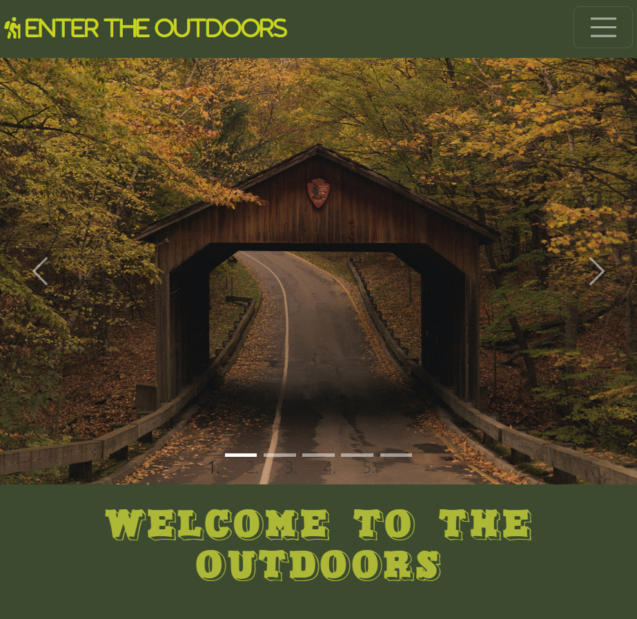
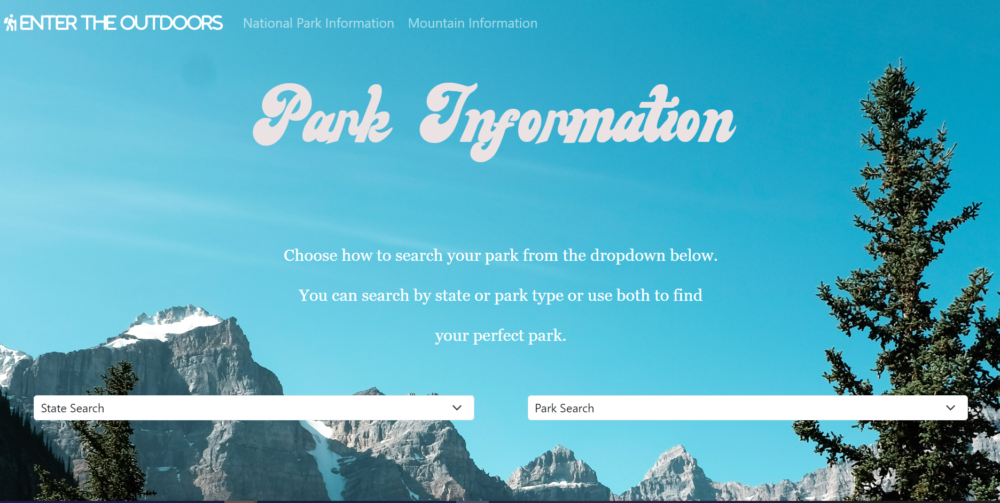
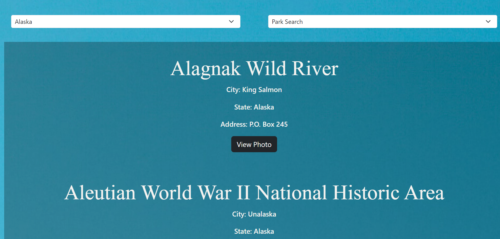
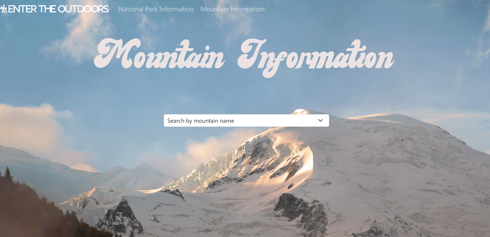
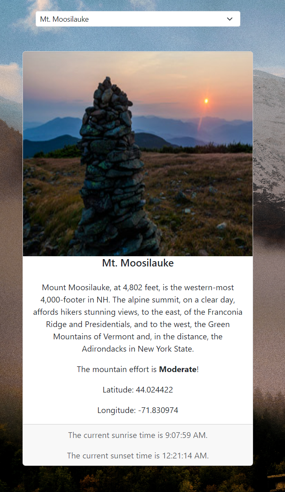

# Capstone-PJ

## capstone pj-2 Enjoy the outdoors

"Second capstone project in the Learn to Code class which consist of three webpages, a home page, a mountain info page, and a national park search page. I experimented with APIs on this project and decided to incorporate Google's Map API on my home page. I also added a button that uses javscript and opens to a a photo of the park from the array. These two features were not a part of the requirements but I wanted to challenge myself on this project."

### Acknowledgements

"Kootkot" on youtube for assistance with method for adding array elements elements with javaScript that was modified for my needs of in the dropdown list

"Dani Krossing" on youtube for assiatnce with map google api for homepage.

### Link

'https://www.youtube.com/watch?v=MkE2_YWnJbo&ab_channel=kootkot'

'https://www.youtube.com/watch?v=9CY0V0JAgNU&ab_channel=DaniKrossing'

### Screenshots

"Below are the screenshots from the project's home page, mountains page and the national parks page as well."

### Homepage

"The homepage is entirely responsive and features a working nav bar that links to the other two pages and a functioning hamburger menu as well. Below is also a description about the site and a functioning map that can search any location in the world. I utilized Google Maps' API."

### National Parks Page

"The national parks page features two select dropdowns that search an array. Once an option is selected the information that is pertinent is pulled from the array and placed for the user to see. The two select dropdown can be used seperately or independently."

### Mountain Page

"The mountain page works similiar to the national parks page except it places the information from the array on a card as well as uses a sunset/sunrise api to tell when the events will occur according to the longitude and latitude for each mountain."

